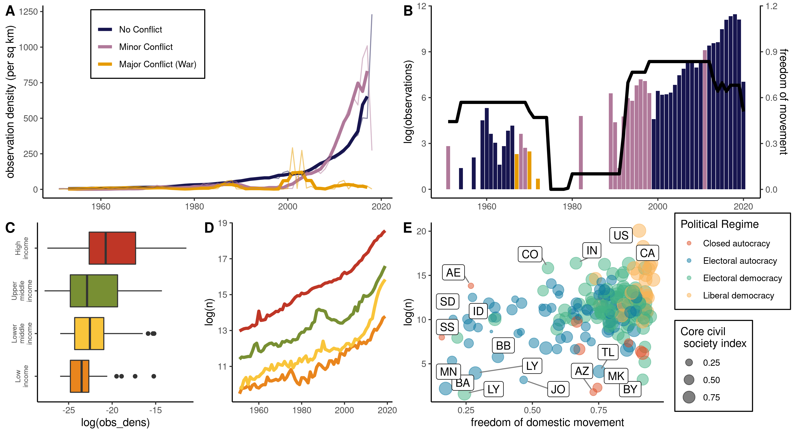
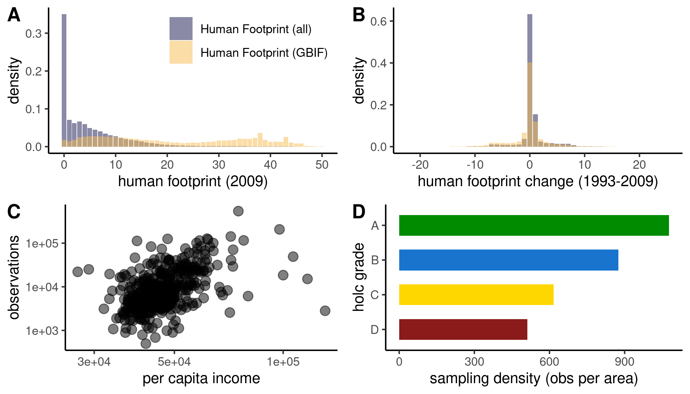
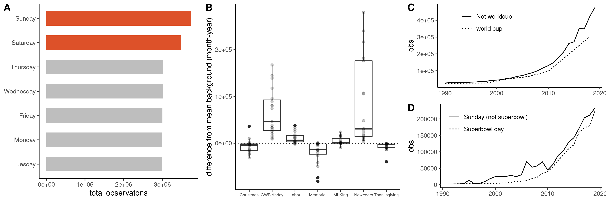

# Human dimensions of GBIF

Some simple ideas I've explored so far (see `/scripts` for code to access/download social data):

## conflict / geopolitics

## human footprint 

## timing / weekly schedules / holidays / sporting events

(kind of nice because these should not influence underlying ecological process, so just observational process)

