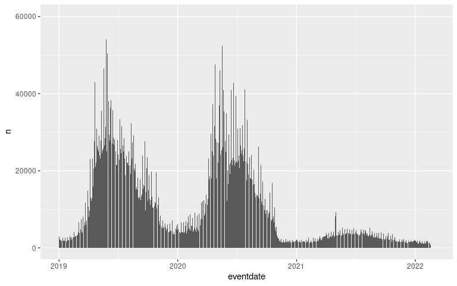
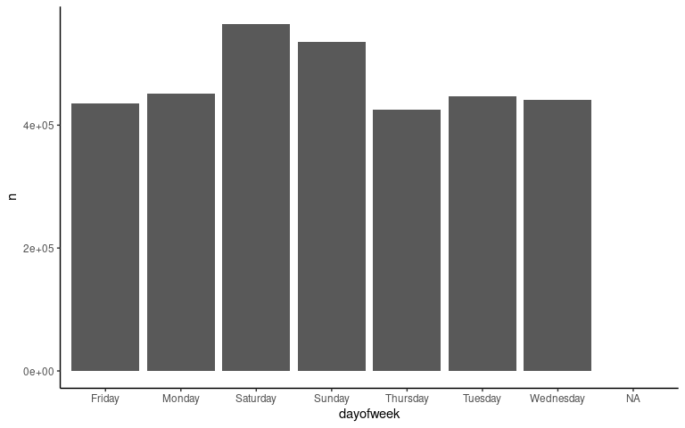
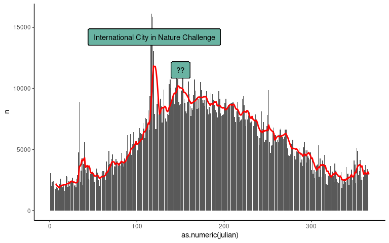
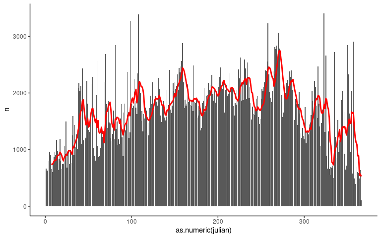
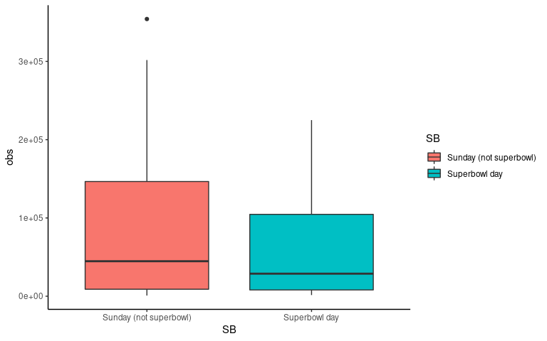
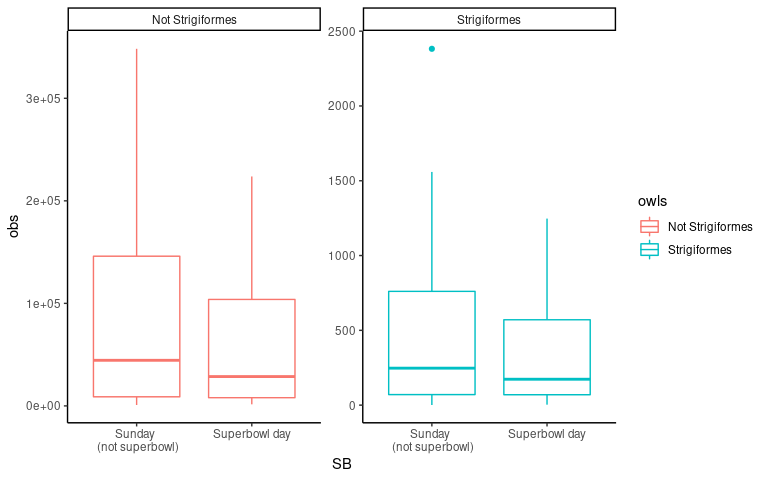
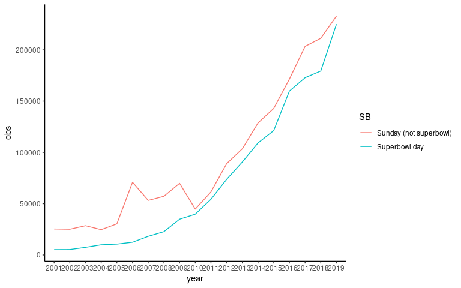

gbif-timing
================
2022-04-01

# Weekends/holidays

``` r
library(tidyverse)
library(gbifdb)
library(zoo)
library(sf)
library(terra)
library(readxl)
library(vdemdata)
library(countrycode)
```

``` r
Sys.setenv("GBIF_HOME"="/home/shared-data/gbif")
db <- gbif_local()
```

``` r
gbif <-  
    db %>%
    #filter(countrycode == "US") %>%
    count(eventdate) %>%
    collect()
```

``` r
gbif %>% 
  mutate(eventdate = as.Date(eventdate),
         year = format(eventdate, "%Y")) %>%
  filter(year > 2018) %>%
  group_by(eventdate) %>%
  count() %>%
  ggplot(aes(eventdate, n)) + geom_col()
```

<!-- -->

``` r
US <-  
    db %>%
    filter(countrycode == "US") %>%
    count(eventdate) %>%
    collect()
```

day of week - more observations on the weekend in the US

``` r
US %>% 
  mutate(eventdate = as.Date(eventdate)) %>%
  mutate(dayofweek =  weekdays(eventdate)) %>%
  group_by(dayofweek) %>%
  count() %>%
  ggplot(aes(dayofweek, n)) + 
  geom_col() + theme_classic()
```

<!-- -->

# Community/citizen science initiatives

2016-2020 you see a pretty pronounced peak at the end of April/first few
days of May which upon a quick google search:

“April 29-May 2 is the City in Nature Challenge, a global citizen
science event that invites people all over the world to explore their
local environment using the app iNaturalist.” (started in 2016 or
2015..)

``` r
yearly <- US %>% 
  mutate(eventdate = as.Date(eventdate),
         year = format(eventdate, "%Y"),
         julian = format(eventdate, "%j"),
         year = as.numeric(year)) %>%
  filter(year >2015 & year < 2021) %>%
  mutate(dayofweek =  weekdays(eventdate)) %>%
  group_by(julian) %>%
  count() %>%
  arrange(julian) 


yearly$n_07da = rollmean(yearly$n, 7, align='right', fill = NA)

yearly %>% 
  ggplot() + 
  geom_col(aes(as.numeric(julian), n)) +
  geom_line(aes(as.numeric(julian), n_07da), color = "red", lwd = 1) +
  geom_label(
    label="International City in Nature Challenge", 
    x=120,
    y=14200,
    label.padding = unit(0.55, "lines"), # Rectangle size around label
    label.size = 0.35,
    color = "black",
    fill="#69b3a2"
  ) + 
  geom_label(
    label="??", 
    x=150,
    y=11500,
    label.padding = unit(0.55, "lines"), # Rectangle size around label
    label.size = 0.35,
    color = "black",
    fill="#69b3a2"
  ) + 
  theme_classic()
## Warning: Removed 6 row(s) containing missing values (geom_path).
```

<!-- -->

Pre- 2016

``` r
yearly <- US %>% 
  mutate(eventdate = as.Date(eventdate),
         year = format(eventdate, "%Y"),
         julian = format(eventdate, "%j"),
         year = as.numeric(year)) %>%
  filter(year >1980 & year < 2016) %>%
  mutate(dayofweek =  weekdays(eventdate)) %>%
  group_by(julian) %>%
  count() %>%
  arrange(julian) 


yearly$n_07da = rollmean(yearly$n, 7, align='right', fill = NA)

yearly %>% 
  ggplot() + 
  geom_col(aes(as.numeric(julian), n)) +
  geom_line(aes(as.numeric(julian), n_07da), color = "red", lwd = 1) +
  theme_classic()
## Warning: Removed 6 row(s) containing missing values (geom_path).
```

<!-- -->

# Superb owls? (Sporting events?)

less observations on superbowl sunday relative to non-superbowl sundays
in Jan/Feb. Expected to see a smaller difference for owls in recent
years (#SuperbOwl citizen science movement) but seemingly no
particularly distinuishable pattern

``` r
US <-  
    gbif_remote(to_duckdb = FALSE, bucket = "gbif", version = "2021-11-01", endpoint_override = "minio.carlboettiger.info") %>%
    filter(countrycode == "US") %>%
    count(eventdate, order) %>%
    collect()

SB <- read_csv("../data/superbowl-dates.csv") %>%
  mutate(eventdate = as.Date(DATE)) %>%
  mutate(SB = "Superbowl day") %>% drop_na() %>%
  select(eventdate, SB)
## Rows: 56 Columns: 2
## ── Column specification ────────────────────────────────────────────────────────
## Delimiter: ","
## chr  (1): NO
## date (1): DATE
## 
## ℹ Use `spec()` to retrieve the full column specification for this data.
## ℹ Specify the column types or set `show_col_types = FALSE` to quiet this message.

US_owls <- US %>% 
  mutate(eventdate = as.Date(eventdate)) %>%
  left_join(SB, by = "eventdate") %>%
  mutate(dayofweek =  weekdays(eventdate),
         month = format(eventdate, "%m")) %>%
  filter(dayofweek == "Sunday")  %>%
  #filter(month == "01" | month == "02") %>%
  mutate(owls = replace(order, order != "Strigiformes", "Not Strigiformes"))
```

``` r
US_owls %>%
  filter(month == "01" | month == "02") %>%
  filter(eventdate > "2011-01-01") %>%
  group_by(eventdate) %>%
  mutate(obs = sum(n)) %>% ungroup() %>%
  group_by(SB) %>%
  summarise(mean = mean(obs, na.rm = TRUE)) %>%
  mutate(SB = replace_na(SB, "Sunday (not superbowl)"))
## # A tibble: 2 × 2
##   SB                        mean
##   <chr>                    <dbl>
## 1 Superbowl day           72485.
## 2 Sunday (not superbowl) 100056.

US_owls %>% 
  filter(month == "01" | month == "02") %>%
  filter(eventdate > "2011-01-01") %>%
  group_by(eventdate, owls) %>%
  mutate(obs = sum(n)) %>% ungroup() %>%
  group_by(SB, owls) %>%
  summarise(mean = mean(obs, na.rm = TRUE)) %>%
  mutate(SB = replace_na(SB, "Sunday (not superbowl)")) %>%
  drop_na() 
## `summarise()` has grouped output by 'SB'. You can override using the `.groups`
## argument.
## # A tibble: 4 × 3
## # Groups:   SB [2]
##   SB                     owls               mean
##   <chr>                  <chr>             <dbl>
## 1 Superbowl day          Not Strigiformes 71873.
## 2 Superbowl day          Strigiformes       610 
## 3 Sunday (not superbowl) Not Strigiformes 99231.
## 4 Sunday (not superbowl) Strigiformes       654.
```

``` r
US_owls %>%
  filter(month == "01" | month == "02") %>%
  filter(eventdate > "2000-01-01") %>%
  group_by(eventdate) %>%
  mutate(obs = sum(n)) %>% ungroup() %>%
  mutate(SB = replace_na(SB, "Sunday (not superbowl)")) %>% drop_na() %>%
  select(eventdate, SB, obs) %>% unique() %>%
  ggplot(aes(x = SB, y = obs, fill = SB)) + geom_boxplot() + 
  theme_classic()
```

<!-- -->

``` r
US_owls %>% 
  filter(month == "01" | month == "02") %>%
  filter(eventdate > "2000-01-01") %>%
  group_by(eventdate, owls) %>%
  mutate(obs = sum(n)) %>% ungroup() %>%
  select(eventdate, SB, obs, owls) %>% unique() %>%
  mutate(SB = replace_na(SB, "Sunday \n (not superbowl)")) %>% drop_na() %>%
  ggplot() + geom_boxplot(aes(x = SB, y = obs, color = owls)) + 
  facet_wrap(~owls, scales = "free") + theme_classic()
```

<!-- -->

``` r
US_owls %>%
  filter(month == "01" | month == "02") %>%
  mutate(year = format(eventdate, "%Y")) %>%
  filter(year > 2000 & year < 2020) %>%
  group_by(eventdate) %>%
  mutate(obs = sum(n)) %>% ungroup() %>%
  mutate(SB = replace_na(SB, "Sunday (not superbowl)")) %>% drop_na() %>%
  select(eventdate, owls, SB, obs, year) %>% unique() %>%
  group_by(year, SB) %>%
  mutate(obs = mean(obs)) %>%
  ggplot(aes(x = year, y = obs, color = SB, group = SB)) + geom_line() + 
  theme_classic()
```

<!-- -->
