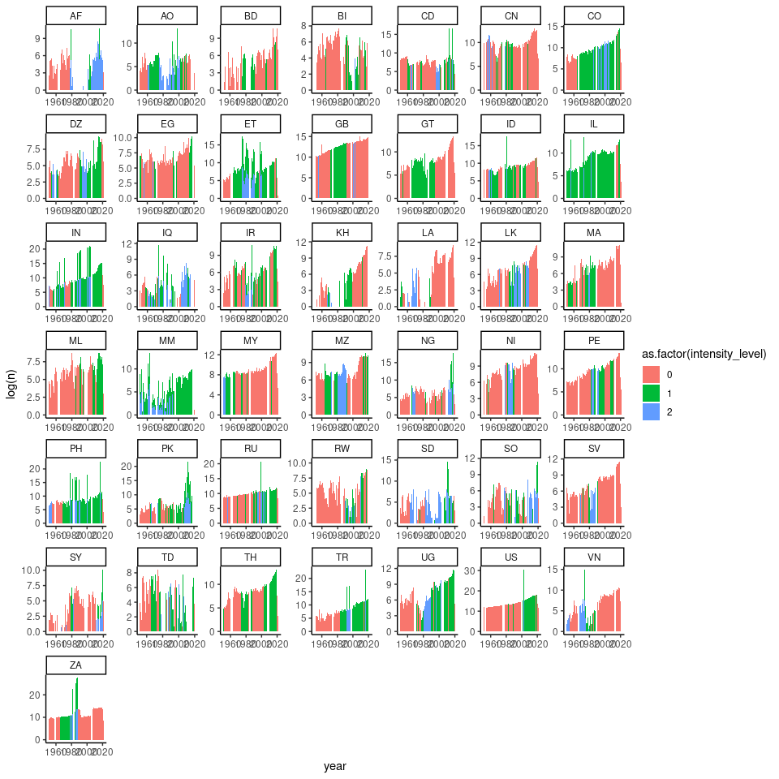
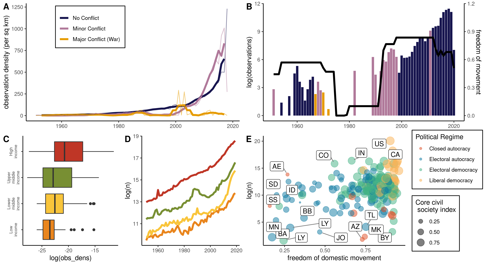

geopolitics-conflict
================
2022-04-06

# Armed conflict / civil unrest

``` r
library(tidyverse)
library(gbifdb)
library(zoo)
library(sf)
library(terra)
library(readxl)
library(vdemdata)
library(countrycode)
library(ggpubr)
library(MetBrewer)
library(feasts)
```

``` r
vdem_df <- vdem %>%
  dplyr::select(country_name, country_text_id, year,
                v2x_regime,
                v2x_corr, # corruption index
                v2x_polyarchy,
                v2x_freexp_altinf,# freedome of expression
                v2xcl_dmove, # movement
                v2x_frassoc_thick, 
                v2xcs_ccsi,
                v2x_clphy,
                e_peaveduc, 
                e_migdppc) %>%
    mutate(countrycode = countrycode(country_name, origin = 'country.name', destination = 'iso2c'))
## Warning in countrycode_convert(sourcevar = sourcevar, origin = origin, destination = dest, : Some values were not matched unambiguously: Baden, Bavaria, Brunswick, German Democratic Republic, Hamburg, Hanover, Hesse-Darmstadt, Hesse-Kassel, Kosovo, Mecklenburg Schwerin, Modena, Nassau, Oldenburg, Parma, Piedmont-Sardinia, Republic of Vietnam, Saxe-Weimar-Eisenach, Saxony, Somaliland, South Yemen, Tuscany, Two Sicilies, Würtemberg, Zanzibar
```

``` r
Sys.setenv("GBIF_HOME"="/home/shared-data/gbif")
db <- gbif_remote(bucket="gbif", endpoint_override = "minio.carlboettiger.info", version="2021-11-01")
```

``` r
country_year <-  db %>%
    count(countrycode, year) %>%
    collect()
```

``` r
conflict <- read_excel("../data/input/ucdp-prio-acd-201.xlsx") %>%
  select(location, year, intensity_level) %>%
  separate_rows(location, sep = ",") %>%
  mutate(countrycode = countrycode(location, origin = 'country.name', destination = 'iso2c'))
## Warning in countrycode_convert(sourcevar = sourcevar, origin = origin, destination = dest, : Some values were not matched unambiguously:  Yemen (North Yemen), Hyderabad, South Vietnam, South Yemen, Yemen (North Yemen)
```

``` r
country_year %>%
  left_join(conflict) %>%
  select(-location) %>%
  filter(year >1950) %>%
  mutate(intensity_level = replace_na(intensity_level, 0)) %>%
  group_by(countrycode) %>% mutate(conflict = sum(intensity_level)) %>%
  ungroup() %>% 
  filter(conflict>20) %>%
  unique() %>% drop_na() %>%
  ggplot(aes(year, log(n), fill = as.factor(intensity_level))) + geom_col() +
  facet_wrap(~countrycode, scales = "free") + theme_classic()
## Joining, by = c("countrycode", "year")
```

<!-- -->

``` r
if (!file.exists("../data/country-boundaries/ne_50m_admin_0_countries.shp")) {
  download.file("https://www.naturalearthdata.com/http//www.naturalearthdata.com/download/50m/cultural/ne_50m_admin_0_countries.zip","../data/country-boundaries/ne_50m_admin_0_countries.zip")
  unzip("../data/country-boundaries/ne_50m_admin_0_countries.zip", exdir = "../data/country-boundaries/")
}
world <- st_read("../data/country-boundaries/ne_50m_admin_0_countries.shp") %>%
  dplyr::select(ISO_A2, REGION_UN, INCOME_GRP) %>%
  mutate(area = st_area(geometry)) %>%
  as_tibble() %>%
  dplyr::select(-geometry) %>%
  mutate(area = as.numeric(area)) %>%
  rename(countrycode = ISO_A2)
## Reading layer `ne_50m_admin_0_countries' from data source 
##   `/home/millie/humanDim-gbif/data/country-boundaries/ne_50m_admin_0_countries.shp' 
##   using driver `ESRI Shapefile'
## Simple feature collection with 242 features and 161 fields
## Geometry type: MULTIPOLYGON
## Dimension:     XY
## Bounding box:  xmin: -180 ymin: -89.99893 xmax: 180 ymax: 83.59961
## Geodetic CRS:  WGS 84
```

``` r
a <- country_year %>%
  left_join(conflict) %>%
  select(-location) %>%
  filter(year >1950 & year < 2020) %>%
  left_join(world) %>%
  mutate(intensity_level = replace_na(intensity_level, 0),
         intensity_level = as.factor(intensity_level)) %>%
  mutate(intensity_level = recode(intensity_level,"0" = "No Conflict", "1" = "Minor Conflict", "2"= "Major Conflict (War)")) %>%
  group_by(intensity_level, year) %>%
  summarise(n = sum(n), 
            area = sum(area, na.rm = TRUE)/10^9) %>%
  mutate(obs_density = n/area,
         intensity_level = as.factor(intensity_level)) %>% 
  group_by(intensity_level) %>%
  mutate(obs_density_05 = zoo::rollmean(obs_density, k = 5, fill = NA)) %>%
  mutate(obs_density = ifelse(year>2018,NA,obs_density)) %>%
  ungroup() %>%
  ggplot() + geom_line(aes(year, obs_density_05, color = intensity_level), lwd=1.5) + 
  scale_color_manual(values=met.brewer("Renoir", 4)) +
  geom_line(aes(x = year, y = obs_density, col = intensity_level, type = intensity_level), alpha = 0.5, lwd = 0.5)+ 
  theme_classic() + theme(legend.position = c(0.3,0.8), legend.title = element_blank(), axis.title.x = element_blank()) + 
  labs(y = "observation density (per sq km)") +
  theme(legend.background = element_rect(colour = 'black', fill = 'white', linetype='solid'))
## Joining, by = c("countrycode", "year")
## Joining, by = "countrycode"
## `summarise()` has grouped output by 'intensity_level'. You can override using
## the `.groups` argument.
## Warning: Ignoring unknown aesthetics: type

a
## Warning: Removed 12 row(s) containing missing values (geom_path).
## Warning: Removed 3 row(s) containing missing values (geom_path).
```

<!-- -->

``` r
# vdem variables mostly from Zizka et al, 2021 paper
vdem_kh <- vdem_df %>% 
  mutate(countrycode = countrycode(country_name, origin = 'country.name', destination = 'iso2c')) %>%
  filter(countrycode == "KH") %>% filter(year > 1950) %>%
  select(countrycode, year, v2xcl_dmove, v2x_regime)
## Warning in countrycode_convert(sourcevar = sourcevar, origin = origin, destination = dest, : Some values were not matched unambiguously: Baden, Bavaria, Brunswick, German Democratic Republic, Hamburg, Hanover, Hesse-Darmstadt, Hesse-Kassel, Kosovo, Mecklenburg Schwerin, Modena, Nassau, Oldenburg, Parma, Piedmont-Sardinia, Republic of Vietnam, Saxe-Weimar-Eisenach, Saxony, Somaliland, South Yemen, Tuscany, Two Sicilies, Würtemberg, Zanzibar
```

``` r
b <- country_year %>%
  full_join(conflict) %>%
  select(-location) %>%
  filter(year >1950) %>%
  mutate(intensity_level = replace_na(intensity_level, 0)) %>%
  mutate(n = replace_na(n, 0)) %>%
  filter(countrycode == "KH") %>% full_join(vdem_kh, by = c("countrycode", "year")) %>%
  unique() %>% 
  ggplot() + 
  geom_col(aes(year, (log(n)), fill = as.factor(intensity_level))) + 
  scale_fill_manual(values=met.brewer("Renoir", 4)) +
  geom_line(aes(year, v2xcl_dmove*10), lwd = 1.5, color = "black") + 
  theme_classic() + theme(legend.position = "none", axis.title.x = element_blank()) +
  scale_y_continuous(
    # Features of the first axis
    name = "log(observations)",
    # Add a second axis and specify its features
    sec.axis = sec_axis( trans=~./10, name="freedom of movement")
  ) #+ geom_line(aes(x = year, y = intensity_level*5)) +
## Joining, by = c("countrycode", "year")
b
## Warning: Removed 3 rows containing missing values (position_stack).
## Warning: Removed 19 rows containing missing values (geom_col).
```

<!-- -->

``` r
library(ggrepel)
c <- country_year %>%
  filter(year >1950) %>%
  mutate(n = replace_na(n, 0)) %>%
  full_join(vdem_df, by = c("countrycode", "year")) %>%
  mutate(v2x_regime = as.factor(v2x_regime)) %>%
  mutate(v2x_regime = recode(v2x_regime,"0" = "Closed autocracy", "1" = "Electoral autocracy", "2"= "Electoral democracy", "3"= "Liberal democracy")) %>%
  group_by(countrycode, v2x_regime) %>%
  summarise(v2xcl_dmove = mean(v2xcl_dmove, na.rm = TRUE),
            v2xcs_ccsi = mean(v2xcs_ccsi, na.rm = TRUE),
            n= sum(n)) %>% drop_na() %>% ungroup()
## `summarise()` has grouped output by 'countrycode'. You can override using the
## `.groups` argument.
c <- c %>%
  rename(`Core civil \n society index` = v2xcs_ccsi, `Political Regime` = v2x_regime) %>%
  ggplot() + 
  geom_point(aes(v2xcl_dmove, log(n), size = `Core civil \n society index`, color = `Political Regime`), alpha = 0.5) + 
  geom_label_repel(aes(v2xcl_dmove, log(n),label = countrycode),
                  box.padding   = 0.35, 
                  point.padding = 0.5,
                  segment.color = 'grey50') +
  theme_classic() +
  theme(legend.position = "right") + 
  labs(x = "freedom of domestic movement") +
  scale_color_manual(values=met.brewer("Egypt", 4)) +
    theme(legend.background = element_rect(colour = 'black', fill = 'white', linetype='solid'))
  
```

after an increase in

``` r
d <- country_year %>%
  filter(year >1950) %>%
  #filter(countrycode == "US") %>%
  mutate(n = replace_na(n, 0)) %>%
  full_join(vdem_df, by = c("countrycode", "year")) %>%
  full_join(world, by = "countrycode") %>% drop_na() %>%
  ggplot() + 
  geom_point(aes(log(e_migdppc), log(n), color = REGION_UN),alpha = 0.2, size = 4) + 
  theme_classic() +
  theme(legend.position = "right", legend.title = element_blank()) + 
  labs(x = "log(GDP)")  +    scale_color_manual(values=met.brewer("Renoir", 5)) 

d
```

<!-- -->

``` r
e <- country_year %>%
  filter(year >1950) %>%
  mutate(n = replace_na(n, 0)) %>%
  full_join(vdem_df, by = c("countrycode", "year")) %>%
  mutate(v2x_regime = as.factor(v2x_regime)) %>%
  mutate(v2x_regime = recode(v2x_regime,"0" = "Closed autocracy", "1" = "Electoral autocracy", "2"= "Electoral democracy", "3"= "Liberal democracy")) %>%
  left_join(world) %>%
  group_by(countrycode, area, INCOME_GRP) %>% 
  summarise(n = sum(n, na.rm = TRUE)) %>% 
  mutate(obs_dens = log(n)/area) %>% drop_na() %>% ungroup() %>%
  mutate(INCOME_GRP = str_sub(INCOME_GRP, 4, -1),
         INCOME_GRP = gsub("\\s", "\n", INCOME_GRP),
         INCOME_GRP = gsub("\\:.*","",INCOME_GRP)) %>%
  ggplot(aes(reorder(INCOME_GRP, obs_dens), log(obs_dens), fill = INCOME_GRP)) + 
  geom_boxplot() + 
  theme_classic() +
  theme(legend.position = "none", legend.title = element_blank()) +
  labs(x = element_blank()) + scale_fill_manual(values=met.brewer("Homer2", 4))  + coord_flip() +
    theme(legend.background = element_rect(colour = 'black', fill = 'white', linetype='solid')) +
  theme(axis.text.y = element_text(angle = 90 , hjust = 0.5, size = 7))
## Joining, by = "countrycode"
## `summarise()` has grouped output by 'countrycode', 'area'. You can override
## using the `.groups` argument.
```

``` r
f <- country_year %>%
  mutate(n = replace_na(n, 0)) %>%
  full_join(vdem_df, by = c("countrycode", "year")) %>%
    filter(year > 1950 & year <2020) %>%
  mutate(v2x_regime = as.factor(v2x_regime)) %>%
  mutate(v2x_regime = recode(v2x_regime,"0" = "Closed autocracy", "1" = "Electoral autocracy", "2"= "Electoral democracy", "3"= "Liberal democracy")) %>%
  left_join(world) %>%
  mutate(INCOME_GRP = str_sub(INCOME_GRP, 4, -1),
         INCOME_GRP = gsub("\\s", "\n", INCOME_GRP),
         INCOME_GRP = gsub("\\:.*","",INCOME_GRP)) %>%
  group_by(year, INCOME_GRP) %>% 
  summarise(n = sum(n, na.rm = TRUE)) %>% drop_na() %>%
  ggplot(aes(year, log(n), color = INCOME_GRP)) + 
  geom_line(lwd =1.5) + 
  theme_classic() +
  theme(legend.position = "none", legend.title = element_blank()) +
  labs(x = "") +  scale_color_manual(values=met.brewer("Homer2", 4)) +
  theme(legend.background = element_rect(colour = 'black', fill = 'white', linetype='solid'))
## Joining, by = "countrycode"
## `summarise()` has grouped output by 'year'. You can override using the
## `.groups` argument.


f <- ggarrange(e, f, labels = c("C", "D"),
          ncol = 2, nrow = 1)
```

# Colonial ties

``` r
country_year_record <-  db %>%
    count(countrycode, year, basisofrecord) %>%
    collect()
```

``` r
colonial_ties <- read_csv("../data/output/colonial_ties.csv")
## Rows: 113 Columns: 9
## ── Column specification ────────────────────────────────────────────────────────
## Delimiter: ","
## chr (6): iso2, iso3, Name, independence_from, cont_ent, cont_suppr
## dbl (3): cow_state, indep_year, timesince
## 
## ℹ Use `spec()` to retrieve the full column specification for this data.
## ℹ Specify the column types or set `show_col_types = FALSE` to quiet this message.
```

``` r
ggarrange(a, b,f, c,
          labels = c("A", "B", "", "E"),
          ncol = 2, nrow = 2)
## Warning: Removed 12 row(s) containing missing values (geom_path).
## Warning: Removed 3 row(s) containing missing values (geom_path).
## Warning: Removed 3 rows containing missing values (position_stack).
## Warning: Removed 19 rows containing missing values (geom_col).
## Warning: ggrepel: 184 unlabeled data points (too many overlaps). Consider
## increasing max.overlaps
```

<!-- -->
