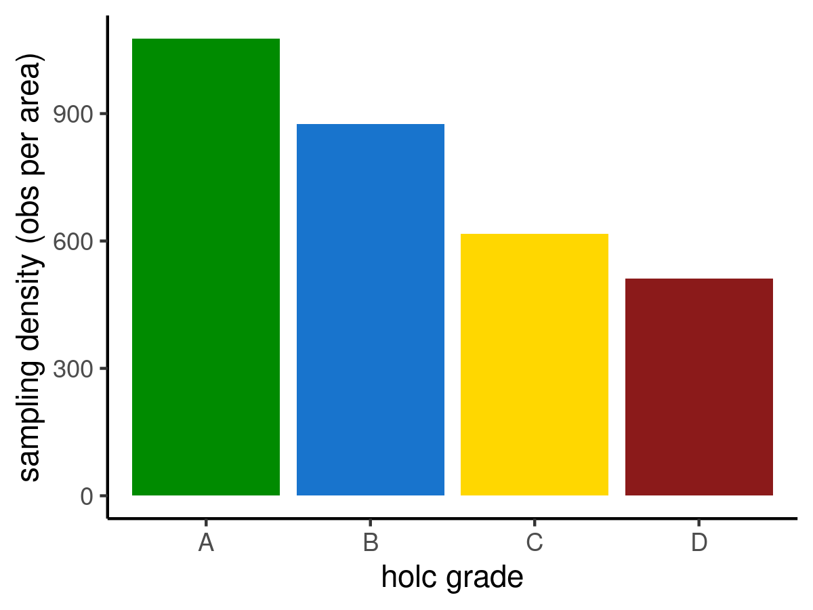

redlining
================
2022-04-06

# Redlining

higher sampling per unit area in neighborhoods that were not
historically redlined.

``` r
library(tidyverse)
library(gbifdb)
library(zoo)
library(sf)
library(terra)
library(readxl)
library(vdemdata)
library(countrycode)
library(patchwork)
```

``` r
# theres certainly a better way to do this but a sloppy first pass
if (!file.exists("../data/output/gbif_holc.csv")) { # this all takes a bit to run...
  
  holc <- st_read("https://dsl.richmond.edu/panorama/redlining/static/fullDownload.geojson") %>%
    select(state, holc_grade, geometry) %>%
    dplyr::filter(!is.na(holc_grade) & holc_grade != 'E') %>%
    dplyr::filter(!st_is_empty(.)) %>%
    sf::st_make_valid(.) %>%
    dplyr::mutate(valid =st_is_valid(holc)) %>% 
    dplyr::filter(valid=="TRUE") 

  US <-  
    gbif_remote(to_duckdb = FALSE, bucket = "gbif", version = "2021-11-01", endpoint_override = "minio.carlboettiger.info") %>%
    filter(countrycode == "US") %>%
    count(class, decimallatitude, decimallongitude) %>%
    collect()

  us_pts <- st_as_sf(US, coords = c("decimallongitude", "decimallatitude"), crs = st_crs(holc))

  holc <- holc %>%
    dplyr::mutate(valid =st_is_valid(holc)) %>% 
    dplyr::filter(valid=="TRUE") 

  #st_intersects is much faster than intersection but not sure how to do this while maintaining polygon info? 
  # heres a clunky workaround
  holcA <- holc %>% filter(holc_grade == "A")
  holcB <- holc %>% filter(holc_grade == "B")
  holcC <- holc %>% filter(holc_grade == "C")
  holcD <- holc %>% filter(holc_grade == "D")

  gbifA = lengths(st_intersects(us_pts, holcA)) > 0
  us_pts$holcA <- gbifA

  gbifB = lengths(st_intersects(us_pts, holcB)) > 0
  us_pts$holcB <- gbifB

  gbifC = lengths(st_intersects(us_pts, holcC)) > 0
  us_pts$holcC <- gbifC

  gbifD = lengths(st_intersects(us_pts, holcD)) > 0
  us_pts$holcD <- gbifD

  as_tibble(us_pts) %>% write_csv("../data/output/gbif_holc.csv")
}
#read in output
gbif_holc <- read_csv("../data/output/gbif_holc.csv")
## Rows: 11957779 Columns: 7
## ── Column specification ────────────────────────────────────────────────────────
## Delimiter: ","
## chr (2): class, geometry
## dbl (1): n
## lgl (4): holcA, holcB, holcC, holcD
## 
## ℹ Use `spec()` to retrieve the full column specification for this data.
## ℹ Specify the column types or set `show_col_types = FALSE` to quiet this message.
```

``` r
holc <- st_read("https://dsl.richmond.edu/panorama/redlining/static/fullDownload.geojson") %>%
  select(state, holc_grade, geometry) %>%
  dplyr::filter(!is.na(holc_grade) & holc_grade != 'E') %>%
  dplyr::filter(!st_is_empty(.)) %>%
  sf::st_make_valid(.) 
## Reading layer `fullDownload' from data source 
##   `https://dsl.richmond.edu/panorama/redlining/static/fullDownload.geojson' 
##   using driver `GeoJSON'
## replacing null geometries with empty geometries
## Simple feature collection with 8878 features and 7 fields (with 3 geometries empty)
## Geometry type: MULTIPOLYGON
## Dimension:     XY
## Bounding box:  xmin: -122.7675 ymin: 25.70537 xmax: -70.9492 ymax: 47.72251
## Geodetic CRS:  WGS 84

holc_area <- holc %>% 
  dplyr::mutate(valid =st_is_valid(holc)) %>% 
  dplyr::filter(valid=="TRUE") %>%
  mutate(area = st_area(geometry)) %>%
  as_tibble() %>%
  group_by(holc_grade) %>%
  summarise(area = as.numeric(sum(area)/10^6))
```

``` r
gbif_holc <- read_csv("../data/output/gbif_holc.csv") %>%
  select(-geometry) %>% 
  rename(A = "holcA", 
         B = "holcB",
         C = "holcC",
         D = "holcD") %>%
  pivot_longer(-c(class,n)) %>%
  filter(value == TRUE) %>%
  group_by(name) %>%
  summarise(n = sum(n)) %>% 
  rename(holc_grade = "name") %>%
  left_join(holc_area) %>%
  mutate(samplingDensity = n/area)
## Rows: 11957779 Columns: 7
## ── Column specification ────────────────────────────────────────────────────────
## Delimiter: ","
## chr (2): class, geometry
## dbl (1): n
## lgl (4): holcA, holcB, holcC, holcD
## 
## ℹ Use `spec()` to retrieve the full column specification for this data.
## ℹ Specify the column types or set `show_col_types = FALSE` to quiet this message.
## Joining, by = "holc_grade"
```

``` r
gbif_holc %>%
  ggplot(aes(x = holc_grade, y = samplingDensity, fill = holc_grade)) + 
  scale_fill_manual(values=c("green4","dodgerblue3", "gold1", "firebrick4")) +
  geom_col() + theme_classic() + theme(legend.position = "none") + 
  labs(x = "holc grade", y = "sampling density (obs per area)")
```

<!-- -->
